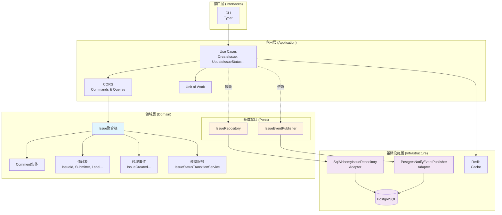

# Issue Tracking 架构设计

> 基于 `docs/issue-tracking/ddd-strategic.md` 和 `docs/issue-tracking/ddd-tactical.md` 生成

---

## 技术选型摘要

| 技术组件 | 选型 | 来源 |
|---------|------|------|
| 接口暴露 | **CLI（Typer）** | 默认值 |
| 异步入口 | PostgreSQL NOTIFY | 默认值 |
| ORM | SqlAlchemy | 默认值 |
| 数据验证 | Pydantic | 默认值 |
| 存储选型 | PostgreSQL | 默认值 |
| 事件总线 | PostgreSQL NOTIFY | 默认值 |
| 缓存 | Redis | 默认值 |

> **说明**：默认仅暴露 CLI 接口。若需要 REST 或 MCP 接口，请明确指定。

---

## 1. 应用层设计 (Application Layer)

### 1.1 用例编排 (Use Cases / Application Services)

| 用例名称 | 核心逻辑 | 依赖的端口/聚合 | 事务边界 |
|---------|---------|----------------|---------|
| **CreateIssue** | 创建新Issue（状态为NEW），发布IssueCreated事件 | IssueRepository, IssueEventPublisher, Issue聚合根 | 单事务：Issue创建 |
| **UpdateIssueStatus** | 验证状态转换合法性，更新Issue状态，发布IssueStatusChanged事件 | IssueRepository, IssueEventPublisher, Issue聚合根, IssueStatusTransitionService | 单事务：Issue状态更新 |
| **UpdateIssueMetadata** | 更新Issue的类型、严重程度、标签，发布IssueMetadataUpdated事件 | IssueRepository, IssueEventPublisher, Issue聚合根 | 单事务：Issue元数据更新 |
| **AddComment** | 为Issue添加评论，发布CommentAdded事件 | IssueRepository, IssueEventPublisher, Issue聚合根 | 单事务：评论添加 |
| **LinkIssueToTask** | 建立Issue与Task的关联，发布IssueLinkedToTask事件 | IssueRepository, IssueEventPublisher, Issue聚合根 | 单事务：TaskLink添加 |
| **UnlinkIssueFromTask** | 解除Issue与Task的关联，发布IssueUnlinkedFromTask事件 | IssueRepository, IssueEventPublisher, Issue聚合根 | 单事务：TaskLink移除 |
| **CloseIssue** | 验证当前状态为RESOLVED，关闭Issue，发布IssueClosed事件 | IssueRepository, IssueEventPublisher, Issue聚合根 | 单事务：Issue关闭 |
| **GetIssueDetails** | 查询Issue详情（含评论、标签、TaskLink） | IssueRepository | 无事务（只读） |
| **ListIssues** | 分页查询Issue列表，支持按类型、状态、标签过滤 | IssueRepository | 无事务（只读） |

#### 核心编排逻辑

**命令型用例工作流**（以 CreateIssue 为例）：

```
1. 接收 CreateIssueCommand
2. 调用 Issue.create() 工厂方法创建聚合根（领域层）
3. 通过 IssueRepository.save() 持久化聚合根（基础设施层）
4. 通过 IssueEventPublisher.publish_all() 发布领域事件（基础设施层）
5. 提交 Unit of Work（事务提交）
```

**通用命令工作流模板**：

```
1. 接收 Command
2. 通过 IssueRepository.find_by_id() 获取聚合根
3. 调用聚合根的业务方法（如 change_status、add_comment）
4. 通过 IssueRepository.save() 持久化变更
5. 通过 IssueEventPublisher.publish_all() 发布聚合根内收集的领域事件
6. 提交 Unit of Work
```

**查询型用例工作流**：

```
1. 接收 Query
2. 直接通过 IssueRepository 查询方法获取数据
3. 返回结果（绕过领域层业务逻辑）
```

#### 编排原则

1. **一次用例仅修改一个聚合根**（Issue）
2. **端口依赖倒置**：应用层依赖领域层定义的 Port 接口，由基础设施层提供实现
3. **事务边界清晰**：一个用例对应一个数据库事务
4. **事件发布时机**：聚合根状态变更后收集事件，事务提交前发布

### 1.2 命令与查询分离 (CQRS) 设计

#### 命令 (Commands)

| 命令名称 | 触发场景 | 修改聚合 | 输入参数 |
|---------|---------|---------|---------|
| **CreateIssueCommand** | 用户/Agent提交新Issue | Issue | title, description, type, severity, submitter |
| **UpdateIssueStatusCommand** | Agent分流或处理Issue | Issue | issueId, newStatus, changedBy |
| **UpdateIssueMetadataCommand** | Agent更新Issue分类信息 | Issue | issueId, type?, severity?, labels? |
| **AddCommentCommand** | 用户/Agent添加评论 | Issue | issueId, content, author |
| **LinkIssueToTaskCommand** | Agent关联Issue与Task | Issue | issueId, taskId |
| **UnlinkIssueFromTaskCommand** | Agent解除Issue与Task关联 | Issue | issueId, taskId |
| **CloseIssueCommand** | Agent确认关闭Issue | Issue | issueId, resolution |

#### 查询 (Queries)

| 查询名称 | 查询场景 | 返回数据 | 是否绕过领域层 |
|---------|---------|---------|---------------|
| **GetIssueDetailsQuery** | 获取Issue完整信息 | Issue聚合完整数据 | 是（直接读取数据库） |
| **ListIssuesQuery** | 分页浏览Issue列表 | Issue摘要列表 | 是（直接读取数据库） |
| **GetIssuesByTaskQuery** | 查询与Task关联的所有Issue | Issue摘要列表 | 是（直接读取数据库） |

#### CQRS 实现策略

| 策略项 | 说明 |
|-------|------|
| **命令路径** | 应用层 → 领域层（聚合根业务方法）→ Port → 适配器 → 数据库 |
| **查询路径** | 应用层 → Port → 适配器 → 数据库（直接读取，不加载完整聚合根业务逻辑） |
| **读写分离** | 写操作使用主数据库，读操作可使用只读副本（后期优化） |

### 1.3 事务与安全边界

| 边界类型 | 说明 |
|---------|------|
| **事务范围** | 一个用例对应一个数据库事务，事务内仅修改单个Issue聚合根 |
| **最终一致性** | 跨聚合操作（如Issue与Task关联）通过领域事件 + PostgreSQL NOTIFY 异步通知 |
| **并发控制** | 使用乐观锁（version字段）防止并发修改冲突 |
| **安全边界** | 所有接口通过CLI暴露，由运维/开发者控制访问；一期无用户认证 |

---

## 2. 接口层设计 (Interface / Presentation Layer)

### 2.1 CLI（命令行接口）

| 配置项 | 值 |
|-------|-----|
| 实现框架 | Typer（默认值） |
| 使用场景 | 本地调试、批量操作、运维管理 |

| CLI命令 | 功能说明 | 参数列表 | 对应应用层用例 |
|---------|---------|---------|---------------|
| `issue create` | 创建新Issue | `--title`, `--description`, `--type`, `--severity`, `--submitter-name`, `--submitter-email` | CreateIssue |
| `issue list` | 列出Issue | `--status`, `--type`, `--labels`, `--limit`, `--offset` | ListIssues |
| `issue show` | 显示Issue详情 | `issue_id` | GetIssueDetails |
| `issue status` | 更新Issue状态 | `issue_id`, `--status`, `--changed-by` | UpdateIssueStatus |
| `issue metadata` | 更新Issue元数据 | `issue_id`, `--type`, `--severity`, `--add-label`, `--remove-label` | UpdateIssueMetadata |
| `issue comment` | 添加评论 | `issue_id`, `--content`, `--author` | AddComment |
| `issue close` | 关闭Issue | `issue_id`, `--resolution` | CloseIssue |
| `issue link` | 关联Task | `issue_id`, `task_id` | LinkIssueToTask |
| `issue unlink` | 解除Task关联 | `issue_id`, `task_id` | UnlinkIssueFromTask |

### 2.2 异步入口

| 配置项 | 值 |
|-------|-----|
| 技术选型 | PostgreSQL NOTIFY（默认值） |
| 监听机制 | 通过SqlAlchemy async engine监听PostgreSQL NOTIFY事件 |

**消费者主题列表**：

| 主题名称 | 消息格式 | 消费逻辑 |
|---------|---------|---------|
| `issue_events` | JSON: `{event_type, issue_id, payload, timestamp}` | 外部系统订阅Issue事件，触发后续处理逻辑 |
| `task_events` | JSON: `{event_type, task_id, payload, timestamp}` | 接收Planning上下文的Task事件（由Agent协调） |

### 2.3 契约设计 (Contracts/DTOs)

| 配置项 | 值 |
|-------|-----|
| 实现框架 | Pydantic（默认值） |
| 设计原则 | DTO仅用于数据传输，不包含业务逻辑，与领域实体严格分离 |

#### 请求 DTOs

| DTO名称 | 所属接口 | 核心字段 | 字段说明 |
|---------|---------|---------|---------|
| **CreateIssueRequest** | issue create | title, description, type, severity, submitter_name, submitter_email | 创建Issue所需的所有信息 |
| **UpdateIssueStatusRequest** | issue status | issue_id, new_status, changed_by | 状态更新请求 |
| **UpdateIssueMetadataRequest** | issue metadata | issue_id, type?, severity?, add_labels?, remove_labels? | 元数据更新 |
| **AddCommentRequest** | issue comment | issue_id, content, author | 评论内容 |
| **LinkIssueToTaskRequest** | issue link | issue_id, task_id | 关联的Task ID |
| **CloseIssueRequest** | issue close | issue_id, resolution? | 关闭原因（可选） |

#### 响应 DTOs

| DTO名称 | 所属接口 | 核心字段 | 字段说明 |
|---------|---------|---------|---------|
| **IssueResponse** | issue show | id, title, description, type, severity, status, submitter, labels, comments, task_links, created_at, updated_at | Issue完整信息 |
| **IssueSummaryResponse** | issue list | id, title, type, severity, status, submitter, labels, created_at | Issue列表项摘要 |
| **CommandResult** | 所有命令 | success, message, issue_id? | 命令执行结果 |

---

## 3. 基础设施层设计 (Infrastructure Layer)

### 3.1 端口与适配器映射 (Ports & Adapters Mapping)

> 核心原则：领域层定义 Port 接口，基础设施层提供 Adapter 实现

| 领域层 Port | 基础设施层 Adapter | 底层依赖 | 实现说明 |
|------------|-------------------|---------|---------|
| **IssueRepository** | SqlAlchemyIssueRepository | PostgreSQL + SqlAlchemy | 实现Issue聚合根的CRUD操作，映射到PostgreSQL表 |
| **IssueEventPublisher** | PostgresNotifyEventPublisher | PostgreSQL NOTIFY | 通过PostgreSQL NOTIFY发布领域事件，支持批量发布 |

#### IssueRepository 适配器实现策略

| 方法 | 实现策略 |
|-----|---------|
| `save(issue)` | 使用SqlAlchemy Session合并/插入Issue聚合根 |
| `find_by_id(issue_id)` | 通过IssueId查询，返回完整聚合根（含内部实体和值对象） |
| `find_all(...)` | 支持多条件过滤的分页查询，返回聚合根列表 |
| `delete(issue_id)` | 软删除或硬删除Issue记录 |
| `find_by_task_id(task_id)` | 通过TaskLink关联表查询关联的Issue |
| `count(...)` | 聚合查询，返回符合条件的Issue数量 |

#### IssueEventPublisher 适配器实现策略

| 方法 | 实现策略 |
|-----|---------|
| `publish(event)` | 将事件序列化为JSON，通过NOTIFY发布到`issue_events`通道 |
| `publish_all(events)` | 批量发布事件，保证同一聚合的事件顺序性，使用事务保证原子性 |

### 3.2 外部服务适配 (Adapters)

| 外部服务 | 调用目的 | 适配方式 | 说明 |
|---------|---------|---------|------|
| Planning上下文 | Task关联信息 | 无直接调用 | Issue Tracking不直接调用Planning，通过Agent桥接 |

> **说明**：Issue与Task通过TaskLink值对象松耦合关联，Issue Tracking仅存储taskId引用，不持有Task实体，无需防腐层。

### 3.3 技术组件落地

#### 事件总线

| 配置项 | 值 |
|-------|-----|
| 选型 | PostgreSQL NOTIFY（默认值） |
| 实现说明 | 通过SqlAlchemy触发和监听NOTIFY事件，实现领域事件的发布与订阅 |

**实现细节**：
1. **发布事件**：`IssueEventPublisher.publish_all()` 在事务提交后通过NOTIFY发布
2. **订阅事件**：后台任务监听`issue_events`通道，分发给事件处理器
3. **事件持久化**：所有领域事件持久化到`domain_events`表，支持审计

#### 缓存

| 配置项 | 值 |
|-------|-----|
| 选型 | Redis（默认值） |
| 实现说明 | 使用redis-py客户端，缓存Issue聚合根 |

**缓存策略**：
1. **缓存键**：`issue:{issue_id}`
2. **缓存失效**：Issue更新时主动删除（Write-Through）
3. **热点缓存**：频繁查询的Issue列表，TTL为5分钟

#### 其他关键技术组件

| 组件名称 | 选型 | 选型理由 |
|---------|------|---------|
| 配置管理 | Pydantic Settings | 类型安全的配置管理，支持环境变量覆盖 |
| 日志系统 | structlog | 结构化日志，便于日志分析和追踪 |
| 依赖注入 | dependency-injector | 与现有TaskGraph项目架构一致，支持依赖反转 |

---

## 4. 架构总览图



**依赖方向说明**：
- 应用层依赖领域层的 Port 接口（依赖倒置）
- 基础设施层实现领域层的 Port 接口
- 领域层不依赖任何外部框架或基础设施

---

## 设计决策记录

| 决策编号 | 决策内容 | 决策理由 | 日期 |
|---------|---------|---------|------|
| A-001 | 使用PostgreSQL NOTIFY作为事件总线 | 简化架构，避免引入额外消息中间件，与存储同源 | 2026-03-18 |
| A-002 | 查询绕过领域层直接读取数据库 | 提升查询性能，避免加载完整聚合根 | 2026-03-18 |
| A-003 | Issue与Task通过TaskLink值对象关联 | 实现松耦合，Issue Tracking不依赖Planning上下文 | 2026-03-18 |
| A-004 | 默认仅暴露CLI接口 | 遵循最小化暴露原则，REST/MCP按需添加 | 2026-03-18 |
| A-005 | 使用dependency-injector进行依赖注入 | 与现有TaskGraph项目架构保持一致 | 2026-03-18 |
| A-006 | 领域端口由战术设计定义，架构层提供适配器映射 | 遵循六边形架构的依赖倒置原则 | 2026-03-18 |

---

## 修改记录

| 日期 | 修改内容 | 原因 |
|------|---------|------|
| 2026-03-18 | 初始版本创建 | 基于 `ddd-strategic.md` 和 `ddd-tactical.md` 进行架构映射设计 |
| 2026-03-18 | 新增端口与适配器映射章节 | 战术设计补充了领域端口定义 |
| 2026-03-18 | 移除REST和MCP接口设计 | 遵循默认仅CLI接口的原则 |
| 2026-03-18 | 补充用例编排工作流描述 | 明确应用层与端口的协作逻辑 |
| 2026-03-18 | 移除目录树结构 | 文档仅专注于组件职责与元数据决策 |