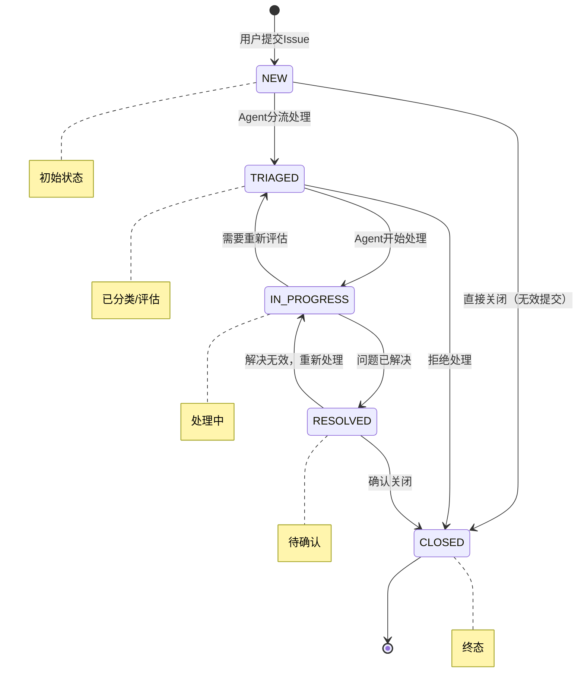
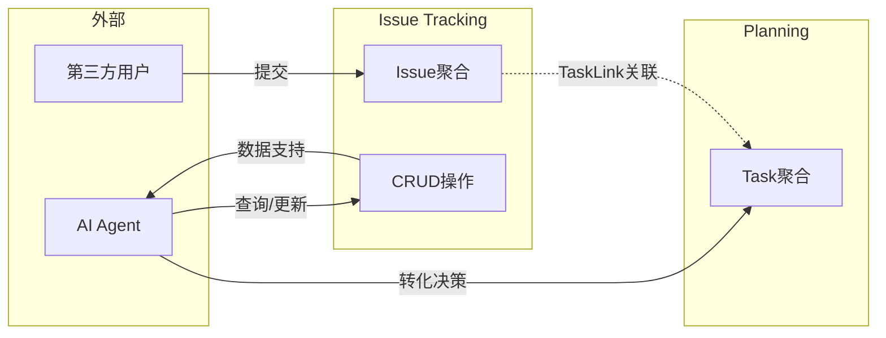

# Issue Tracking 战略设计

## 1. 命名与核心愿景

### 名称
- **中文名称**: 问题追踪
- **英文名称**: Issue Tracking

### 核心职责
管理第三方用户提交的Issue（Bug报告、需求请求）的收集、生命周期管理和基础CRUD操作。

### 问题陈述
现有Planning模块专注于已结构化Task的规划与执行，缺乏接收和管理外部用户反馈的入口。Issue Tracking提供：
1. **Issue收集入口**：接收第三方用户的非结构化输入
2. **生命周期管理**：管理Issue从新建到关闭的完整状态流转
3. **基础操作支持**：为Agent提供Issue的查询、更新等数据操作能力

### 边界说明
- **Issue Tracking负责**：Issue的存储、状态流转、评论管理、标签管理等CRUD操作
- **Agent负责**：Issue的分类评估、优先级判断、转化为Task的决策逻辑、重复检测等智能处理

---

## 2. 统一语言词汇表

| 术语 | 英文别名 | 业务定义 |
|------|---------|---------|
| **问题** | Issue | 第三方用户提交的反馈，包括Bug报告、功能需求、问题咨询等，是本模块的核心概念 |
| **提交者** | Submitter | 提交Issue的外部用户，可能是最终用户、测试人员、合作伙伴等 |
| **问题类型** | IssueType | Issue的分类：BUG（缺陷）、FEATURE（功能需求）、QUESTION（咨询）、IMPROVEMENT（改进建议） |
| **严重程度** | Severity | Issue的紧急程度：CRITICAL、MAJOR、MINOR、LOW |
| **问题状态** | IssueStatus | Issue的生命周期状态 |
| **评论** | Comment | 对Issue的讨论、补充信息、反馈等 |
| **标签** | Label | 用于分类和筛选Issue的标记，如"frontend"、"backend"、"performance"等 |
| **任务链接** | TaskLink | Issue与Task之间的关联关系，支持一对多、多对一关系 |

### IssueStatus 状态流转

**状态说明**：

| 状态 | 含义 | 可转换至 |
|------|------|---------|
| NEW | 新建，等待分流 | TRIAGED, CLOSED |
| TRIAGED | 已分类评估，等待处理 | IN_PROGRESS, CLOSED |
| IN_PROGRESS | 正在处理中 | RESOLVED, TRIAGED |
| RESOLVED | 已解决，等待确认关闭 | CLOSED, IN_PROGRESS |
| CLOSED | 已关闭（终态） | - |

---

## 3. 与Planning模块的关系

### 协作关系

### 集成方式

**Issue Tracking作为数据提供方**：
- 通过MCP工具暴露CRUD接口
- Agent调用接口进行Issue的查询、状态更新、评论添加等操作
- Agent根据Issue数据自主决定是否转化为Task，并通过Planning的接口创建Task

**与Planning的松耦合**：
- Issue Tracking不依赖Planning模块
- Issue与Task通过`TaskLink`值对象建立关联（存储在Issue侧）
- 不需要领域事件，由Agent协调两个模块的交互

---

## 4. MCP工具接口

| 工具名称 | 用途 | 说明 |
|---------|------|------|
| `create_issue` | 创建新Issue | 用户提交或Agent代提交 |
| `list_issues` | 分页查询Issue | 支持按类型、状态、标签过滤 |
| `get_issue_details` | 获取Issue详情 | 含评论历史 |
| `update_issue_status` | 更新Issue状态 | 状态流转 |
| `update_issue_metadata` | 更新Issue元数据 | 类型、严重程度、标签等 |
| `add_comment` | 添加评论 | 支持用户和Agent |
| `link_issue_to_task` | 关联Task | 建立TaskLink关系 |
| `close_issue` | 关闭Issue | 终态操作 |

---

## 5. 核心假设

1. **Issue与Task的独立性**: Issue和Task是两个独立的领域概念，Issue可以独立存在
2. **一对多关系**: 一个Issue可能拆分为多个Task（复杂需求）
3. **多对一关系**: 多个Issue可能关联同一个Task（重复报告合并处理）
4. **一期无认证**: 允许匿名提交Issue
5. **Agent驱动决策**: 分类、评估、转化等智能逻辑由Agent处理，Issue Tracking仅提供数据操作
6. **无SLA要求**: 一期不实现响应时间SLA
7. **无统计报表**: 一期不实现统一的统计分析报表

---

## 审核确认

> **【阶段 1 完成】**
> 1. 战略设计草案已写入文件：`docs/issue-tracking/ddd-strategic.md`
> 2. 请审核关键决策：
>    - **命名**：Issue Tracking（问题追踪）
>    - **职责边界**：CRUD操作 vs Agent决策
>    - **状态流转**：NEW → TRIAGED → IN_PROGRESS → RESOLVED → CLOSED
>    - **集成方式**：通过MCP工具，由Agent协调
> 3. 若需修改，请直接说明修改点；若确认无误，请回复"确认锁定战略设计"，进入下一阶段（聚合设计）。