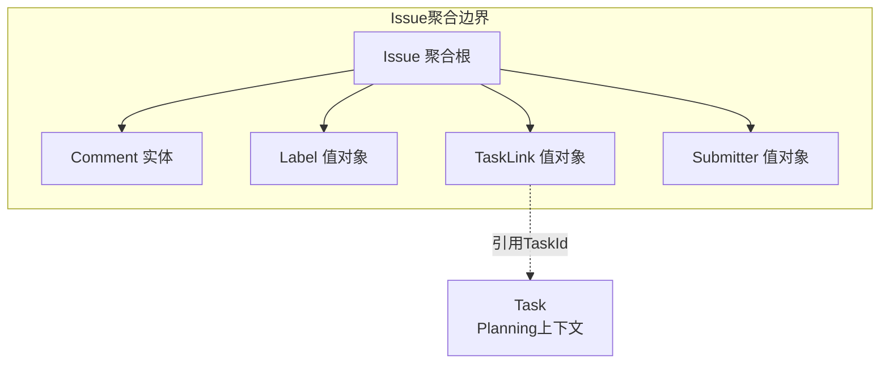

# Issue Tracking 战术领域建模

> 基于 `docs/issue-tracking/ddd-strategic.md` 锁定的战略设计生成

---

## 1. 聚合与聚合根 (Aggreg & Aggregate Roots)

### 聚合划分原则

本次聚合划分基于以下依据：

1. **事务一致性边界**：Issue及其附属数据（评论、标签）必须在同一事务内保持一致
2. **业务内聚性**：Comment必须依附于Issue存在，无独立生命周期；Label作为分类标记与Issue紧密关联
3. **生命周期独立性**：Issue有完整的独立生命周期，是本上下文的核心概念

### 聚合根列表

| 聚合根名称 | 核心职责 | 一致性边界说明 |
|-----------|---------|---------------|
| **Issue** | 管理Issue的完整生命周期，协调内部实体和值对象，保证状态流转规则的一致性 | Issue及其附属的Comment、Label、TaskLink在同一事务边界内 |

### 聚合关系

Issue Tracking上下文仅有一个聚合根（Issue），不存在聚合间的直接关联。

Issue与Planning上下文的Task通过`TaskLink`值对象建立松耦合关联，不直接持有Task引用。



---

## 2. 实体与值对象 (Entities & Value Objects)

### 实体 (Entities)

| 实体名称 | 所属聚合 | 唯一标识 | 核心属性 | 业务规则 |
|---------|---------|---------|---------|---------|
| **Comment** | Issue | CommentId (UUID) | content, author, createdAt | 1. 评论创建后不可修改<br>2. 评论必须关联一个已存在的Issue<br>3. 评论内容不能为空 |

**为何是实体**：Comment拥有唯一标识（CommentId），具有独立的时间戳（createdAt），生命周期可追溯（创建时间记录），满足实体的定义特征。

### 值对象 (Value Objects)

| 值对象名称 | 所属聚合/实体 | 核心属性 | 不可变性规则 | 业务校验规则 |
|-----------|-------------|---------|-------------|-------------|
| **IssueId** | Issue | value: UUID | 创建后不可变 | 必须为有效的UUID格式 |
| **CommentId** | Comment | value: UUID | 创建后不可变 | 必须为有效的UUID格式 |
| **Submitter** | Issue | name, email, externalId? | 创建后不可变 | email必须符合邮箱格式；name不能为空 |
| **IssueType** | Issue | value: Enum | 创建后不可变 | 仅允许: BUG, FEATURE, QUESTION, IMPROVEMENT |
| **Severity** | Issue | value: Enum | 创建后不可变 | 仅允许: CRITICAL, MAJOR, MINOR, LOW |
| **IssueStatus** | Issue | value: Enum | 状态变更返回新对象 | 仅允许: NEW, TRIAGED, IN_PROGRESS, RESOLVED, CLOSED；状态流转必须符合状态机规则 |
| **Label** | Issue | name, color? | 创建后不可变 | name不能为空，最大长度50字符；color为可选十六进制颜色码 |
| **TaskLink** | Issue | taskId, linkedAt | 创建后不可变 | taskId必须为有效的UUID；linkedAt记录关联时间 |
| **IssueTitle** | Issue | value: str | 创建后不可变 | 不能为空，最大长度200字符 |
| **IssueDescription** | Issue | value: str | 创建后不可变 | 不能为空，最大长度10000字符 |

**为何是值对象**：

| 值对象 | 判断依据 |
|-------|---------|
| IssueId | 无独立生命周期，仅作为标识符，比较时基于值相等 |
| CommentId | 同上 |
| Submitter | 描述"谁提交了Issue"的属性集合，比较时基于属性值相等（同名同邮箱即为同一提交者） |
| IssueType | 枚举类型，表示分类概念，无生命周期 |
| Severity | 枚举类型，表示紧急程度概念，无生命周期 |
| IssueStatus | 枚举类型，表示状态概念，通过状态机规则控制变更 |
| Label | 分类标记，仅关注名称和颜色值，无独立身份 |
| TaskLink | 描述Issue与Task的关联关系，仅包含关联信息，无独立生命周期 |
| IssueTitle | 文本内容，仅关注字符串值本身 |
| IssueDescription | 文本内容，仅关注字符串值本身 |

---

## 3. 领域事件 (Domain Events)

### 事件列表

| 事件名称 | 触发时机 | 所属聚合 | 携带数据 | 业务意义 |
|---------|---------|---------|---------|---------|
| **IssueCreated** | Issue创建成功后立即发布 | Issue | issueId, title, issueType, severity, submitter | 标记新Issue进入系统，可用于通知Agent进行分流处理 |
| **IssueStatusChanged** | Issue状态变更后立即发布 | Issue | issueId, previousStatus, newStatus, changedAt, changedBy | 记录状态流转历史，可用于触发后续流程（如RESOLVED时通知提交者） |
| **IssueClosed** | Issue进入CLOSED状态时发布 | Issue | issueId, closedAt, resolution | 标记Issue处理完成，可用于统计分析 |
| **CommentAdded** | 评论添加成功后立即发布 | Issue | issueId, commentId, content, author, addedAt | 记录讨论历史，可用于通知相关人员 |
| **IssueLinkedToTask** | TaskLink建立时发布 | Issue | issueId, taskId, linkedAt | 标记Issue与Task建立关联，可用于跨上下文协调 |
| **IssueUnlinkedFromTask** | TaskLink移除时发布 | Issue | issueId, taskId, unlinkedAt | 标记Issue与Task解除关联 |
| **IssueMetadataUpdated** | Issue元数据（类型、严重程度、标签）更新时发布 | Issue | issueId, updatedFields, updatedAt | 记录元数据变更，可用于审计追踪 |

### 事件发布规则

| 规则项 | 说明 |
|-------|------|
| **发布时机** | 聚合根状态变更后立即发布（在事务提交前） |
| **持久化** | 所有领域事件需持久化到事件存储，支持事件溯源和审计 |
| **跨上下文传播** | `IssueLinkedToTask`、`IssueUnlinkedFromTask` 需传播至Planning上下文（由Agent协调，通过MCP接口） |
| **事件顺序** | 同一Issue的事件按时间戳严格排序，保证因果一致性 |

---

## 4. 领域服务 (Domain Services)

### 服务列表

| 服务名称 | 核心逻辑 | 依赖聚合 | 无状态说明 |
|---------|---------|---------|-----------|
| **IssueStatusTransitionService** | 验证Issue状态流转的合法性，封装状态机规则 | Issue | 无状态，仅根据当前状态和目标状态判断是否允许转换 |

### 服务详细说明

**IssueStatusTransitionService**

```
核心职责：封装Issue状态机的转换规则验证

状态转换规则表：
- NEW → TRIAGED: 允许（Agent分流）
- NEW → CLOSED: 允许（无效提交直接关闭）
- TRIAGED → IN_PROGRESS: 允许（开始处理）
- TRIAGED → CLOSED: 允许（拒绝处理）
- IN_PROGRESS → RESOLVED: 允许（问题已解决）
- IN_PROGRESS → TRIAGED: 允许（需要重新评估）
- RESOLVED → CLOSED: 允许（确认关闭）
- RESOLVED → IN_PROGRESS: 允许（解决无效，重新处理）
- 其他转换: 不允许

方法签名：
- can_transition(current_status: IssueStatus, target_status: IssueStatus) -> bool
- validate_transition(current_status: IssueStatus, target_status: IssueStatus) -> raises InvalidStatusTransitionError
```

**为何需要领域服务**：状态流转规则是跨多个Issue实例的业务规则，不属于单个Issue聚合根的内部逻辑，且需要被多个用例复用（如Agent分流、手动处理），故抽取为领域服务。

---

## 5. 领域端口 (Domain Ports)

### 核心定义

领域端口定义领域层为了完成持久化、发布事件或与外部世界交互所需的抽象接口契约。端口由领域层定义，由基础设施层实现，遵循依赖倒置原则（DIP）。

### 端口列表

| 端口名称 | 所属聚合 | 核心契约职责 |
|---------|---------|-------------|
| **IssueRepository** | Issue | Issue聚合根的持久化操作，包括创建、查询、更新、删除 |
| **IssueEventPublisher** | Issue | 发布Issue相关的领域事件，支持事件溯源和跨上下文通知 |

### 端口详细契约

#### IssueRepository

| 方法名称 | 入参 | 返回值 | 说明 |
|---------|------|--------|------|
| save | issue: Issue | None | 持久化Issue聚合根（新增或更新） |
| find_by_id | issue_id: IssueId | Issue \| None | 根据ID查询Issue，不存在返回None |
| find_all | status?, issue_type?, severity?, labels?, limit, offset | list[Issue] | 分页查询Issue，支持多条件过滤 |
| delete | issue_id: IssueId | bool | 删除Issue，返回是否成功 |
| find_by_task_id | task_id: str | list[Issue] | 查询关联了指定TaskId的所有Issue |
| count | status?, issue_type? | int | 统计Issue数量，支持条件过滤 |

#### IssueEventPublisher

| 方法名称 | 入参 | 返回值 | 说明 |
|---------|------|--------|------|
| publish | event: DomainEvent | None | 发布单个领域事件 |
| publish_all | events: list[DomainEvent] | None | 批量发布领域事件，保证顺序性 |

### 端口设计说明

| 端口 | 设计考量 |
|-----|---------|
| **IssueRepository** | 1. 仅操作Issue聚合根，不暴露Comment、Label等内部结构<br>2. 查询方法返回完整的Issue聚合根（包含内部实体和值对象）<br>3. 支持多条件组合过滤，满足MCP工具的查询需求 |
| **IssueEventPublisher** | 1. 抽象事件发布机制，基础设施层可选择实现（消息队列、事件存储等）<br>2. 支持批量发布，保证同一聚合的事件顺序<br>3. 领域层不关心事件的具体传输方式 |

---

## 6. 聚合根详细设计

### Issue 聚合根

**属性清单**：

| 属性名 | 类型 | 说明 |
|-------|------|------|
| id | IssueId | 唯一标识 |
| title | IssueTitle | 标题 |
| description | IssueDescription | 详细描述 |
| type | IssueType | 问题类型 |
| severity | Severity | 严重程度 |
| status | IssueStatus | 当前状态 |
| submitter | Submitter | 提交者信息 |
| labels | list[Label] | 标签列表 |
| comments | list[Comment] | 评论列表 |
| taskLinks | list[TaskLink] | 关联的Task列表 |
| createdAt | datetime | 创建时间 |
| updatedAt | datetime | 最后更新时间 |

**核心行为**：

| 行为名称 | 入参 | 前置条件 | 后置条件 | 发布事件 |
|---------|------|---------|---------|---------|
| create | title, description, type, severity, submitter | 标题、描述、类型、严重程度、提交者均有效 | 创建新Issue，状态为NEW | IssueCreated |
| change_status | new_status, changed_by | 状态转换符合状态机规则 | 状态更新为新状态 | IssueStatusChanged |
| close | resolution | 当前状态为RESOLVED | 状态变为CLOSED | IssueClosed |
| add_comment | content, author | Issue已存在，内容非空 | 评论添加到列表末尾 | CommentAdded |
| add_label | label | 标签名称有效 | 标签添加到列表（去重） | IssueMetadataUpdated |
| remove_label | label_name | 标签存在 | 标签从列表移除 | IssueMetadataUpdated |
| link_to_task | task_id | Issue已存在，taskId有效 | TaskLink添加到列表 | IssueLinkedToTask |
| unlink_from_task | task_id | TaskLink存在 | TaskLink从列表移除 | IssueUnlinkedFromTask |
| update_metadata | type?, severity? | 新值有效 | 指定字段更新 | IssueMetadataUpdated |

**不变性约束**：

1. Issue一旦创建，id、submitter、createdAt不可变更
2. 状态变更必须符合状态机规则（通过IssueStatusTransitionService验证）
3. 同一Issue的taskLinks中taskId不允许重复
4. 同一Issue的labels中name不允许重复

---

## 7. 业务规则汇总

| 规则编号 | 规则描述 | 所属聚合/实体 |
|---------|---------|-------------|
| BR-001 | Issue创建时状态必须为NEW | Issue |
| BR-002 | Issue状态流转必须符合状态机规则 | Issue |
| BR-003 | CLOSED状态的Issue不允许任何修改（终态锁定） | Issue |
| BR-004 | 评论创建后内容不可修改 | Comment |
| BR-005 | 一个Issue可关联多个Task，但同一taskId只能关联一次 | Issue |
| BR-006 | 标签名称在同一Issue内不允许重复 | Issue |
| BR-007 | Issue标题最大200字符，描述最大10000字符 | Issue |
| BR-008 | 提交者邮箱必须符合邮箱格式 | Submitter |
| BR-009 | 严重程度默认为MINOR，类型默认为QUESTION | Issue |

---

## 8. 与Planning上下文的协作约定

| 协作场景 | 协作方式 | 说明 |
|---------|---------|------|
| Issue转Task | Agent调用Issue Tracking查询接口，再调用Planning创建Task接口 | Agent作为协调者，两个上下文不直接耦合 |
| Task状态更新通知Issue | Agent监听Task事件，调用Issue Tracking更新接口 | 松耦合，通过Agent桥接 |
| Issue关联Task | 通过TaskLink值对象存储taskId引用 | 仅存储引用，不持有Task实体 |

---

## 设计决策记录

| 决策编号 | 决策内容 | 决策理由 | 日期 |
|---------|---------|---------|------|
| D-001 | Comment作为实体而非值对象 | Comment有唯一标识和创建时间，需要追溯谁在何时说了什么 | 2026-03-17 |
| D-002 | Submitter作为值对象 | 提交者信息是Issue的属性集合，无独立生命周期需求 | 2026-03-17 |
| D-003 | TaskLink不持有Task实体引用 | Issue Tracking不应依赖Planning上下文，通过taskId值引用实现松耦合 | 2026-03-17 |
| D-004 | 状态流转规则抽取为领域服务 | 状态机规则跨多个用例复用，且不属于单个Issue的内部逻辑 | 2026-03-17 |
| D-005 | CLOSED状态锁定，不允许修改 | 终态数据应保持稳定，避免历史数据被篡改 | 2026-03-17 |

---

## 修改记录

| 日期 | 修改内容 | 原因 |
|------|---------|------|
| 2026-03-17 | 初始版本创建 | 基于 `ddd-strategic.md` 进行战术领域建模 |
| 2026-03-17 | 表格名称统一为英文Pascal形式 | 提升文档规范性，便于代码实现对照 |
| 2026-03-18 | 新增领域端口（Domain Ports）章节 | 补充领域层与基础设施层的接口契约定义 |
| 2026-03-18 | 端口契约改为表格形式 | 移除伪代码，保持文档风格一致 |