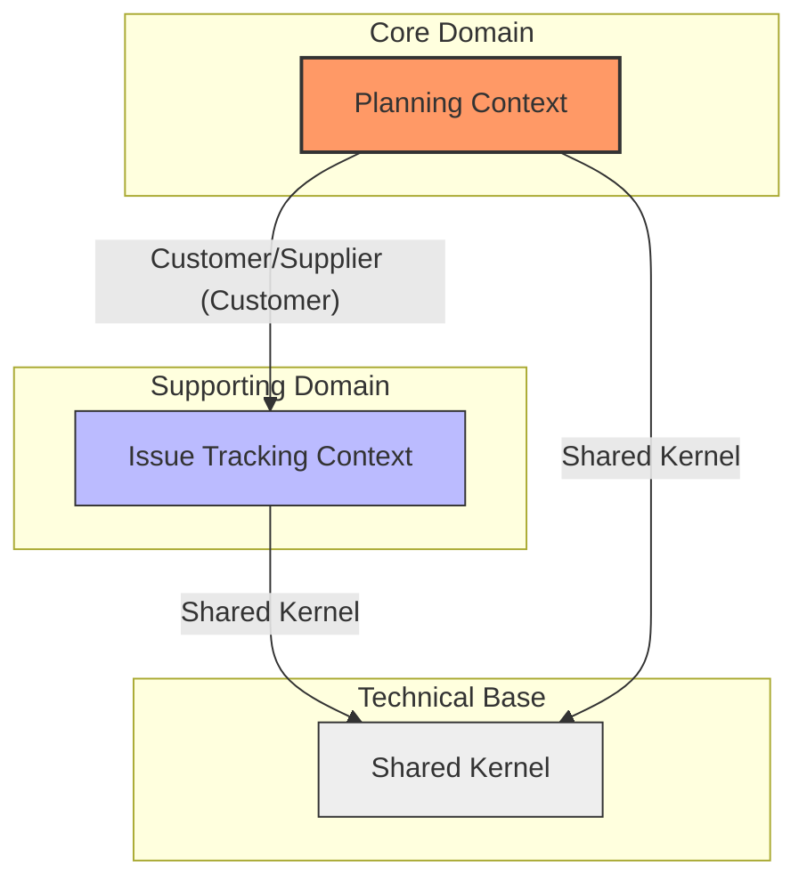

# 限界上下文映射图 (Context Map)

## 1. 业务上下文关系预览

## 2. 上下文协作模式说明

### Planning Context & Issue Tracking Context
*   **关系模式**：**Customer/Supplier (客户/供应商)**
*   **业务描述**：
    *   `Planning` (核心域) 是 **Customer**，它消耗由 `Issue Tracking` 产生的反馈数据，并将其转化为具有执行价值的 Task。
    *   `Issue Tracking` (支撑域) 是 **Supplier**，负责为下游提供高质量的原始需求/缺陷信息。
*   **集成策略**：
    *   **ID 引用 (Linkage)**：`Issue Tracking` 维护 `TaskLink` 值对象，通过 `TaskId` 建立逻辑关联，但不持有 `Planning` 中的实体，保持物理上的解耦。
    *   **Agent 编排**：系统不采用强耦合的领域事件同步，而是由外部 Agent 作为协调者，从 `Issue Tracking` 读取状态并驱动 `Planning` 中的任务创建与更新。

### Planning/Issue Tracking & Shared Kernel
*   **关系模式**：**Shared Kernel (共享内核)**
*   **业务描述**：
    *   所有限界上下文共同依赖 `Shared` 模块中定义的领域驱动设计基础构件（如 `AggregateRoot`, `ValueObject`）、全局错误码、统一的事件总线接口以及 ORM 映射规范。
*   **变更约束**：
    *   对 `Shared Kernel` 的任何修改必须经过所有限界上下文所有者的共同评审，以防止破坏性变更引发的级联失败。

## 3. 边界协议与防腐策略

*   **松耦合引用**：`Issue Tracking` 虽然引用了 `Planning` 的标识符，但将其视为一个不透明的字符串/UUID。这种设计实现了逻辑上的 **Conformist** (遵从者) 与物理上的 **Separate Ways** (各行其道) 之间的平衡。
*   **无直接领域模型依赖**：严禁在 `Issue Tracking` 的领域逻辑中导入 `Planning` 的模型类，反之亦然。所有跨上下文的通信必须通过 DTO 或原始标识符进行。
